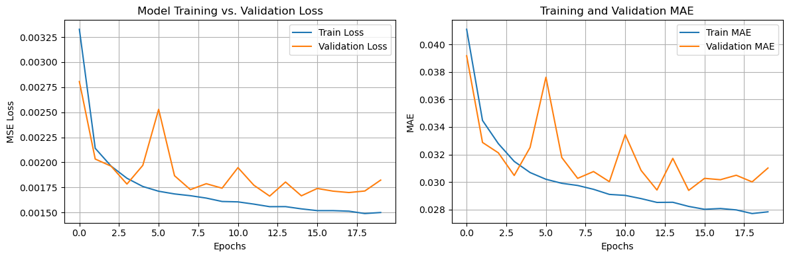
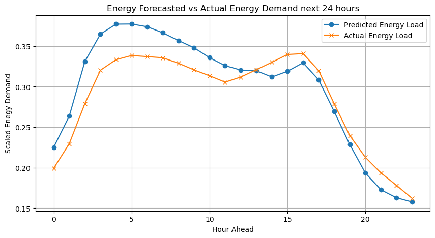
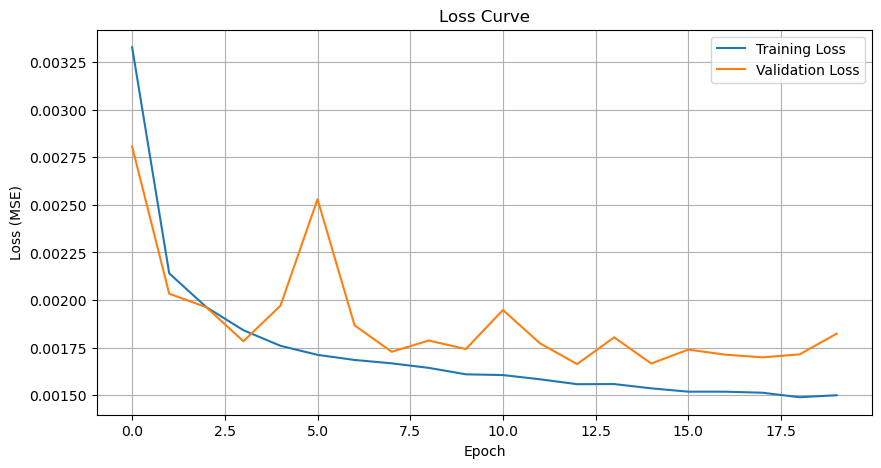
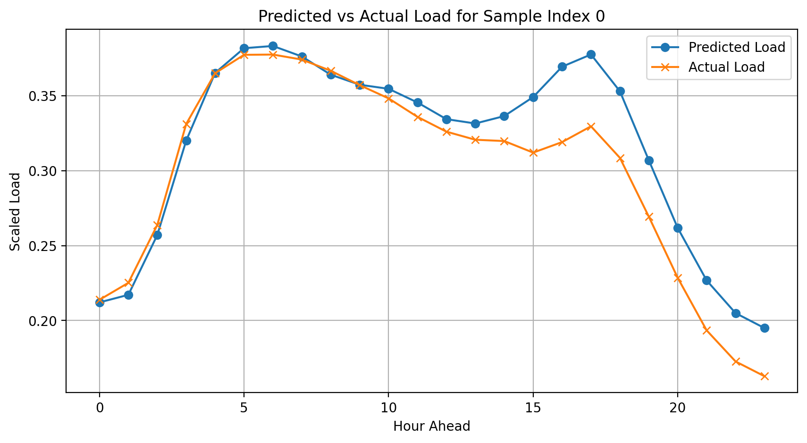

# Energy Forecasting with Deep Learning ⚡️

[](https://github.com)
[](LICENSE)

---

## Table of Contents
- [Project Overview](#project-overview)
- [Repository Structure](#repository-structure)
- [Quick Start](#quick-start)
- [Data](#data)
- [Notebooks & Models](#notebooks--models)
- [Results & Visualizations](#results--visualizations)
- [Reproducibility (How to run)](#reproducibility-how-to-run)
- [Contributing](#contributing)
- [License & Contact](#license--contact)

---

## Project Overview 🔍
**Energy Forecasting with Deep Learning** is a compact, reproducible project that demonstrates multiple approaches for short-term (hourly) load forecasting using time-series modeling. The repository includes baseline models (naive and dense feed-forward), feature engineering, exploratory data analysis, and an LSTM memory-based forecasting model that predicts the next 24 hours using the previous 168 hours.

---

## Repository Structure 📂
```
000_naive_baseline_models/
001_baseline_dense_model/
002_LSTM_model/
EDA/
Evaluation/
raw/                  # raw PJME_hourly.csv dataset
visuals/              # evaluation & result plots (included)
README.md
```

Key notebooks:
- `EDA/EDA.ipynb` — exploratory data analysis and transformation steps
- `000_naive_baseline_models/000_naive_baseline_model.ipynb` — naive baseline approach
- `001_baseline_dense_model/baseline_dense_model_predicition.ipynb` — dense network baseline (note: filename contains a typo: "predicition")
- `002_LSTM_model/LSTM_memorybased_forecasting_model.ipynb` — LSTM forecasting model

---

## Quick Start ⚡️
1. Clone the repo:
```bash
git clone <your-repo-url>
cd <repo-dir>
```
2. Create a Python virtual environment and install dependencies:
```bash
python -m venv .venv
source .venv/bin/activate
pip install -r requirements.txt
```
> Tip: If you don't have `requirements.txt`, install common packages used in the notebooks: `pandas`, `numpy`, `scikit-learn`, `matplotlib`, `tensorflow` (tested with 2.15.x), `jupyter`.


3. Start Jupyter and run notebooks interactively:
```bash
jupyter lab
```

---

## Data 🗂️
- Original raw data: `raw/PJME_hourly.csv` (hourly load data).
- Preprocessed / feature-engineered file used by notebooks: `001_baseline_dense_model/feature_engineered_load.csv`.

The notebooks include the full pipeline for loading, cleaning, feature engineering (hour, dayofweek, month, year), scaling, windowing (168-hour input → 24-hour horizon), training, and evaluation.

---

## Notebooks & Models 🧠
- Baselines:
  - Naive: `000_naive_baseline_models/` (simple naive forecasts)
  - Dense model: `001_baseline_dense_model/baseline_dense_model_predicition.ipynb`
- LSTM memory-based model: `002_LSTM_model/LSTM_memorybased_forecasting_model.ipynb`
  - Input shape: last 168 hours (7 days)
  - Output (horizon): next 24 hours
  - Uses `MinMaxScaler` for scaling and `Mean Absolute Error` (MAE) for primary evaluation

---

## Results & Visualizations 📈
The repository already contains evaluation visuals in `visuals/`. Examples:

**LSTM vs Dense model (24-hour horizon)**


**Dense model evaluation**



**Dense model forecast vs True**



**Training loss curve (Dense)**



**Predicted dense model results (sample)**



> These images illustrate model predictions and training metrics.

---

## Reproducibility — How to Run (Step-by-step) 🔁
1. Ensure your environment has the required packages (see Quick Start).
2. Open `EDA/EDA.ipynb` and run cells to reproduce the feature engineering and save `feature_engineered_load.csv`.
3. Run `000_naive_baseline_models/000_naive_baseline_model.ipynb` to generate naive baseline forecasts and evaluation metrics.
4. Run `001_baseline_dense_model/baseline_dense_model_predicition.ipynb` to train and evaluate the dense baseline. Save `dense_model_predictions.csv` to compare with LSTM.
5. Run `002_LSTM_model/LSTM_memorybased_forecasting_model.ipynb` to train the LSTM and produce comparison plots. Use the included early stopping callback for robust training.

Tips:
- Use a GPU to speed up LSTM training when available.
- If you want deterministic results, set seeds for `numpy`, `tensorflow`, and `python`'s `random` at the start of notebooks.

---

## Evaluation Metrics ✅
- Primary metric: Mean Absolute Error (MAE)
- Also consider: Root Mean Squared Error (RMSE), Mean Absolute Percentage Error (MAPE)

The notebooks print MAE for sample forecasts and include visualization comparing true vs predicted loads.

---

## Contributing & Extending 🔧
Contributions are welcome — suggestions:
- Add hyperparameter search (Optuna or Keras Tuner)
- Add probabilistic forecasting (quantile loss or Bayesian methods)
- Introduce exogenous variables (weather, holidays)
- Wrap models with a minimal inference API (FastAPI/Flask)

Available on request: a **trimmed `requirements.txt`** (core packages), a **`Makefile`** for reproducible commands, or a **GitHub Actions CI workflow** to run notebooks/tests.

---

## License & Contact 📬
This repository is provided under the **GNU General Public License v3.0 (GPL-3.0)**. See the `LICENSE` file for the full text.
